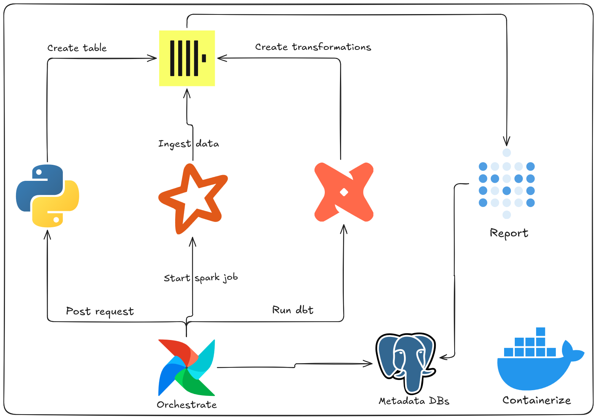

# BikeSpark

**BikeSpark** is an end-to-end ELT (Extract, Load, Transform) pipeline that processes Citi Bike trip data.
It downloads historical trip data, ingests it into ClickHouse using Apache Spark, orchestrates the workflow with Apache Airflow,
transforms raw data into analytics-ready models using dbt, and provides interactive dashboards via Metabase.

## Architechture



## Pipeline Flow

1. **Download** - Historical Citi Bike trip CSV data and clickhouse JDBC diriver is downloaded to the local machine
2. **Orchestrate** - Apache Airflow triggers the `citibike_elt_dag` DAG
3. **Create** - The DAG creates the `raw_trips` table in ClickHouse
4. **Extract & Load** - Apache Spark reads the CSV files and bulk-loads them into ClickHouse
5. **Transform** - dbt transforms raw data into staging (`stg_trips`) and mart models (`fact_trips`, `dim_station`, `dim_user`)
6. **Visualize** - Metabase connects to ClickHouse to build interactive dashboards and visualizations

## Tech Stack

| Component        | Technology     | Usage                                                                                    |
| ---------------- | -------------- | ---------------------------------------------------------------------------------------- |
| Orchestration    | Apache Airflow | Defines, schedules, and monitors the ELT pipeline workflows via directed acyclic graphs. |
| Processing       | Apache Spark   | Reads raw CSV files and bulk-loads them into ClickHouse with distributed computation.    |
| Transformation   | dbt            | Transforms raw data into clean, analytics-ready staging and mart models using SQL.       |
| Warehouse        | ClickHouse     | Stores all trip data as a high-performance columnar database optimized for analytics.    |
| Metadata Store   | PostgreSQL     | Persists internal metadata for Airflow and Metabase services.                            |
| BI/Visualization | Metabase       | Provides a web-based interface for building queries, charts, and dashboards.             |
| Containerization | Docker Compose | Packages and runs all services as isolated containers with a single command.             |
| Task Runner      | Just           | Provides convenient shortcuts for common Docker Compose operations.                      |

## Prerequisites

- **Git**
- **Docker** & **Docker Compose**
- **Just** command runner (optional)

## Getting Started

### 1. Clone the Repository

```bash
git clone <repository-url>
cd bikespark
```

### 2. Configure Environment

Generate the Airflow environment file with your user ID and absolute project path:

```bash
echo -e "AIRFLOW_UID=$(id -u)\nABSOLUTE_PATH=$(pwd)" > airflow/.env
```

### 3. Download the Dataset

Run the download script to fetch the 2014 Citi Bike trip data and the ClickHouse JDBC driver:

```bash
chmod +x spark/download_citibike.sh
# Ensure you have `wget` and `unzip` installed on your system to run the script successfully.
./spark/download_citibike.sh
```

### 4. Start the Pipeline

Launch all services:

```bash
# using just (recommended)
just up
# or
docker compose up -d
```

> [!NOTE]
> I will be using `just` for all commands in this README, but you can achieve the same results by looking in `justfile` to see the equivalent commands.

### 5. Run the ELT Pipeline

Navigate to the Airflow UI (default: `http://localhost:8080`) and log in with username `admin` and the password you can get it from the generated file in the Airflow container.

> [!IMPORTANT]
> To get the Airflow admin password, you can run:
>
> ```bash
> docker exec airflow cat simple_auth_manager_passwords.json.generated
> ```

Find the `citibike_elt_dag` DAG, and trigger it manually. The pipeline will:

1. **Create** the `raw_trips` table in ClickHouse
2. **Ingest** all CSV files into ClickHouse via Spark
3. **Transform** raw data into staging and mart models via dbt

### 6. Explore the Data in Metabase

Create visualizations and dashboards in Metabase (default: `http://localhost:3000`) and connect to clickhouse using the following credentials:

- Host: `clickhouse`
- Port: `8123`
- Database: `default`
- Username: `default`
- Password: `default`

> [!TIP]
> Using **Metabot**:
>
> - In top right corner, click on the circle with 4 squares and select "Admin"
> - From top bar select "AI"
> - Connect to AI provider
> - Choose provider "Anthropic" and input your API key
> - Once connected, you can go to the main page and you will see in the top right corner a new icon with a robot
> - Click on the new icone and you can ask natural language questions about your data and it will generate the SQL query for you.

## dbt Models

| Model         | Type      | Description                                   |
| ------------- | --------- | --------------------------------------------- |
| `stg_trips`   | Staging   | Renames columns from raw format to snake_case |
| `fact_trips`  | Fact      | Trip records with surrogate keys              |
| `dim_station` | Dimension | Deduplicated station information              |
| `dim_user`    | Dimension | Aggregated user profiles                      |

## Service Ports

| Service      | Port | URL                   |
| ------------ | ---- | --------------------- |
| Airflow      | 8080 | http://localhost:8080 |
| Metabase     | 3000 | http://localhost:3000 |
| ClickHouse   | 8123 | http://localhost:8123 |
| Spark Master | 8081 | http://localhost:8081 |

## Project Structure

```
bikespark/
├── compose.yml                 # Main Docker Compose entrypoint
├── justfile                    # Just task runner commands
├── airflow/
│   ├── compose.yml             # Airflow service
│   ├── Dockerfile              # Custom Airflow image
│   ├── requirements.txt        # Python dependencies
│   └── dags/
│       └── citibike_elt_dag.py # Main orchestration DAG
├── spark/
│   ├── compose.yml             # Spark master/worker services
│   ├── download_citibike.sh    # Script to download Citi Bike dataset
│   └── jobs/
│       └── ingestion_job.py    # Spark job: CSV → ClickHouse
├── dbt/
│   ├── compose.yml             # dbt runner service
│   ├── Dockerfile              # Custom dbt image
│   ├── pyproject.toml          # Python project config
│   ├── profiles/
│   │   └── profiles.yml        # dbt connection profiles
│   └── citibike_project/
│       ├── dbt_project.yml
│       └── models/
│           ├── staging/
│           │   └── srg_trips.sql   # Staging: clean & rename columns
│           └── marts/
│               ├── fact_trips.sql  # Fact table: trip facts with surrogate keys
│               ├── dim_station.sql # Dimension: unique stations
│               └── dim_user.sql    # Dimension: user profiles
├── clickhouse/
│   └── compose.yml             # ClickHouse database service
├── postgres/
│   ├── compose.yml             # PostgreSQL service
│   └── metadata-init/
│       ├── airflow-init.sql    # Airflow metadata database
│       └── metabase-init.sql   # Metabase metadata database
└── metabase/
    └── compose.yml             # Metabase BI service
```

## Troubleshooting

### Permission Denied on Airflow

If Airflow fails to start, ensure the `AIRFLOW_UID` is set correctly in `airflow/.env`:

```bash
echo -e "AIRFLOW_UID=$(id -u)\nABSOLUTE_PATH=$(pwd)" > airflow/.env
just rebuild
```

### Spark Job Cannot Connect to ClickHouse

Ensure all services are on the same Docker network and ClickHouse is healthy:

```bash
just ps
just logs clickhouse
```

### dbt Models Fail to Build

Verify that the `raw_trips` table exists in ClickHouse before running dbt. The Airflow DAG creates this table automatically before triggering the Spark and dbt steps.

### Dataset Not Found

If Spark cannot locate CSV files, ensure the download script was executed:

```bash
./spark/download_citibike.sh
ls spark/citibike_2014/
```

### Corrupted Volumes

If services behave unexpectedly, perform a clean reset:

```bash
just down-all
just up
```

> [!WARNING]
> This removes all persisted data.

### Viewing Detailed Logs

Debug a specific service by following its logs:

```bash
just logs spark-master
```

### Enter shell of a running container

```bash
just shell airflow
```
